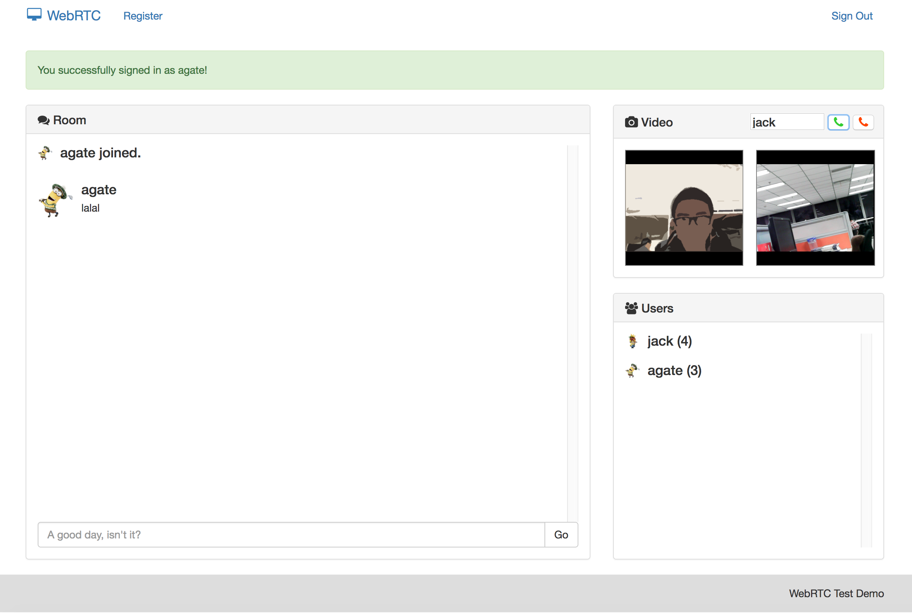

# WebRTC Demo

* 实现 *Learning WebRTC* 中的简单服务器与客户端。
* 在 `http` 模式下启动Chrome需要额外命令：

`/Applications/Google\ Chrome.app/Contents/MacOS/Google\ Chrome --user-data-dir=/tmp/foo --unsafely-treat-insecure-origin-as-secure=http://10.108.113.238:8080`

# WebRTC KOA2

扩展自 [廖雪峰的Node.js教程](http://www.liaoxuefeng.com/wiki/001434446689867b27157e896e74d51a89c25cc8b43bdb3000/001472794708264206fcf1589bb43caa0395752aa26538c000)，结合了 Demo 中的音视频通信。

示例如下：

